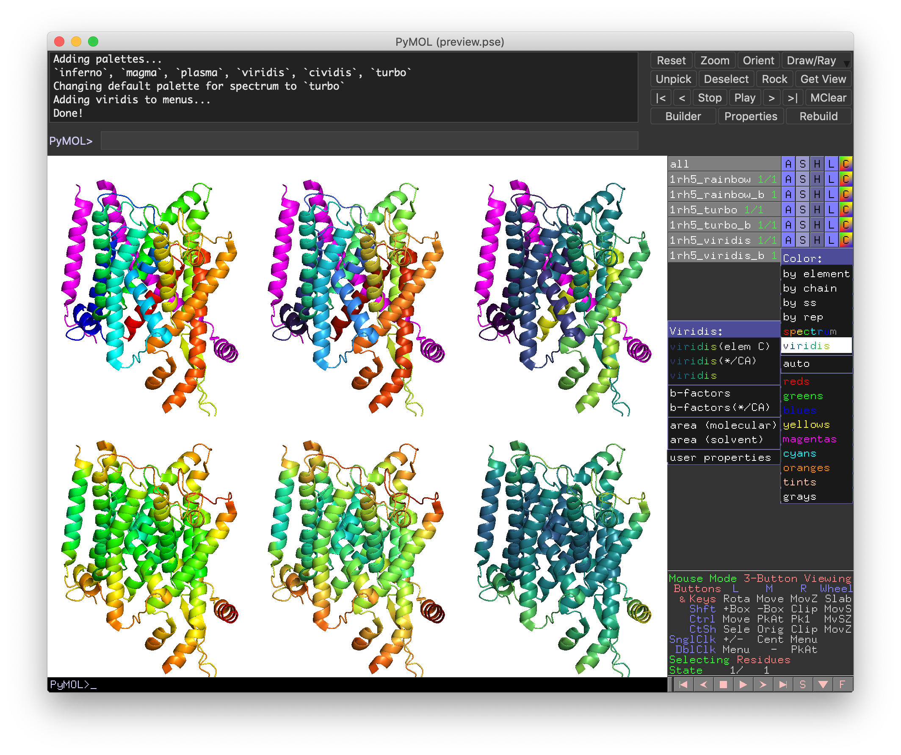

pymol_viridis
=============

Script to add viridis and other colorblind-accessible (and perceptually uniform)
palettes to PyMOL and viridis to color (`C`) menus.
The default palette for `spectrum` is set to
[`turbo`](https://ai.googleblog.com/2019/08/turbo-improved-rainbow-colormap-for.html).

All the new palettes
([`viridis`, `magma`, `inferno`, `plasma`](https://bids.github.io/colormap),
[`cividis`](https://doi.org/10.1371/journal.pone.0199239),
`turbo`)
can be used in pymol wherever builtin palettes can be specified,
e.g. instead of specifying
`... spectrum palette="blue_green" ... `, specify `... spectrum="viridis" ...`.

Just run `viridispalettes.py` and you are off!

### Technical details

New palettes are added to the dictionary `pymol.viewing.palette_colors_dict`
with their common name as key and palette specified as space-delimited
string of hex colors (prefix `0x` not `#`) as value.

[`spectrum`](https://pymolwiki.org/index.php/Spectrum) uses `palette=rainbow`
by default and is monkey patched to use `palette=turbo` by default instead.

New menus/menu-options are created where ever `spectrum` options exist by
simply specifying the `palette='viridis'` to the `spectrum` invocation.
Text is colorized for viridis options by using the `\\RGB` specification.

The new colormaps are added via their 256-hex colors
from [bokeh.palettes](https://github.com/bokeh/bokeh/blob/b19f2c5/bokeh/palettes.py)
(not via named colors)
to stay as true as possible to the original colormap specifications.

Interpolation (when done) is handled by `spectrumany`.
In the current release (v2.3), this is done linearly in RGB space.
In future versions, interpolation can be done in
a more perceptual space
([Issue in Pymol repo/PR by @speleo3](https://github.com/schrodinger/pymol-open-source/pull/69)).
Since the colormaps here are specified in terms of 256 hex colors,
interpolation in RGB will be just fine.
